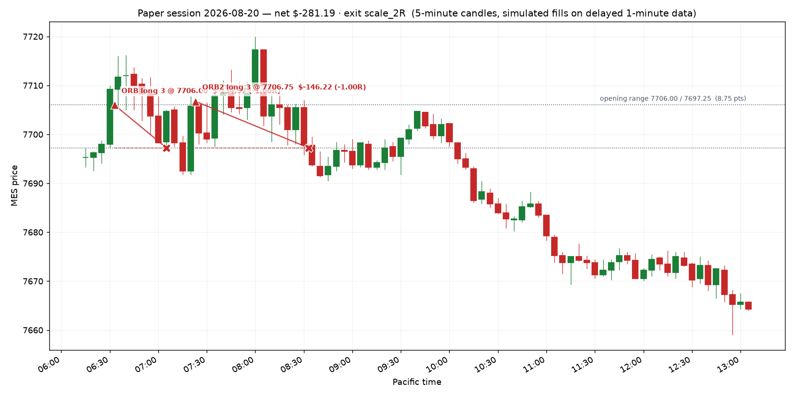

# Paper session — 2026-08-20

**Net P&L $-281.19** · 2 trade(s) · does not qualify (needs $300 net)

- Opening range: 7706.00 / 7697.25  (8.75 pts)
- Day ended: 2 consecutive losses — the market is not offering your setup today.
- All times Pacific.
- One opening range break per day: the first one. If the Fib pullback appears afterwards it is the second trade, under the same day limits.
- Target was $325, loss stop was $450

## Trades

| in | out | setup | side | qty | entry | stop | exit | pts | R | net $ | exit reason |
|---|---|---|---|---|---|---|---|---|---|---|---|
| 06:33 | 07:05 | ORB | long | 3 | 7706.00 | 7697.25 | 7697.25 | -8.75 | -1.00 | -134.97 | stop |
| 07:23 | 08:33 | ORB2 | long | 3 | 7706.75 | 7697.25 | 7697.25 | -9.50 | -1.00 | -146.22 | stop |

## The day on a chart

Entry is the triangle, exit the cross, the dashed line is the stop that was working while the trade was on; the dotted levels are the opening range.

## Setups the rules refused

- FIB long: Reward:risk is 0.03:1, below your 1.5:1 minimum. Skip it — Apex also prohibits disproportionate risk outright.
- FIB short: Reward:risk is 0.86:1, below your 1.5:1 minimum. Skip it — Apex also prohibits disproportionate risk outright.

## Where this leaves the account

- Balance $100,004.05 · total P&L $4.05
- Qualifying days: **0 of 5** ($300+ net each)
- Profit to the first payout request: $3,595.95 of $3,600.00
- EOD threshold sits at a $97,576.41 balance — $2,146.45 of room below you
- Payout: still needs 5 more qualifying day(s) of >= $300 net; $3,595.95 more profit (need +$3,600); $468.53 more profit spread over other days: your best day is 5834% of cycle profit (must be under 50%)

_Simulated fills on delayed data. No broker, no orders, no automation — the engine only shows what the written rules would have done._