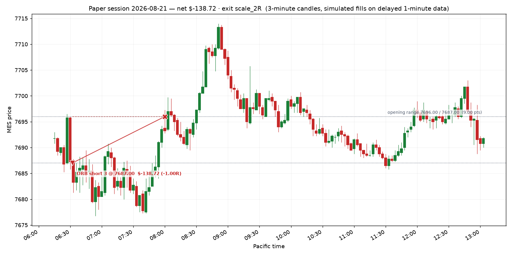

# Paper session — 2026-08-21

**Net P&L $-138.72** · 1 trade(s) · does not qualify (needs $300 net)

- Opening range: 7696.00 / 7687.00  (9.00 pts)
- Day ended: the day's one opening range break was taken and closed
- All times Pacific.
- One opening range break per day: the first one. If the Fib pullback appears afterwards it is the second trade, under the same day limits.
- Target was $325, loss stop was $450

## Trades

| in | out | setup | side | qty | entry | stop | exit | pts | R | net $ | exit reason |
|---|---|---|---|---|---|---|---|---|---|---|---|
| 06:32 | 08:00 | ORB | short | 3 | 7687.00 | 7696.00 | 7696.00 | -9.00 | -1.00 | -138.72 | stop |

## The day on a chart

Entry is the triangle, exit the cross, the dashed line is the stop that was working while the trade was on; the dotted levels are the opening range.

## Setups the rules refused

- FIB long: Reward:risk is 1.41:1, below your 1.5:1 minimum. Skip it — Apex also prohibits disproportionate risk outright.

## Where this leaves the account

- Balance $99,865.33 · total P&L $-134.67
- Qualifying days: **0 of 5** ($300+ net each)
- Profit to the first payout request: $3,734.67 of $3,600.00
- EOD threshold sits at a $97,576.41 balance — $2,150.20 of room below you
- Payout: still needs 5 more qualifying day(s) of >= $300 net; $3,734.67 more profit (need +$3,600)

_Simulated fills on delayed data. No broker, no orders, no automation — the engine only shows what the written rules would have done._