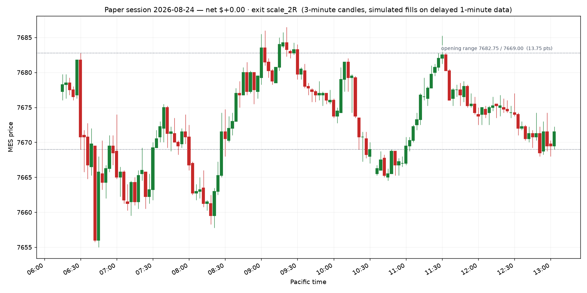

# Paper session — 2026-08-24

**Net P&L $0.00** · 0 trade(s) · does not qualify (needs $300 net)

- Opening range: 7682.75 / 7669.00  (13.75 pts)
- Day ended: the opening break came and the rules refused it — no-trade day
- All times Pacific.
- One opening range break per day: the first one. If the Fib pullback appears afterwards it is the second trade, under the same day limits.
- Target was $325, loss stop was $450

## Trades

None. A day with no setup is a normal day, not a failure.

## The day on a chart

Entry is the triangle, exit the cross, the dashed line is the stop that was working while the trade was on; the dotted levels are the opening range.

## Setups the rules refused

- ORB short: Stop is 13.75 pts — wider than your 12 pt max. A stop this wide means you do not actually know where you are wrong.
- FIB short: Stop is 18.00 pts — wider than your 12 pt max. A stop this wide means you do not actually know where you are wrong.
- FIB long: Reward:risk is 1.03:1, below your 1.5:1 minimum. Skip it — Apex also prohibits disproportionate risk outright.
- FIB short: Reward:risk is 0.79:1, below your 1.5:1 minimum. Skip it — Apex also prohibits disproportionate risk outright.
- FIB long: Reward:risk is 1.39:1, below your 1.5:1 minimum. Skip it — Apex also prohibits disproportionate risk outright.
- FIB long: Reward:risk is 0.95:1, below your 1.5:1 minimum. Skip it — Apex also prohibits disproportionate risk outright.
- FIB short: Reward:risk is 1.29:1, below your 1.5:1 minimum. Skip it — Apex also prohibits disproportionate risk outright.

## Where this leaves the account

- Balance $99,865.33 · total P&L $-134.67
- Qualifying days: **0 of 5** ($300+ net each)
- Profit to the first payout request: $3,734.67 of $3,600.00
- EOD threshold sits at a $97,576.41 balance — $2,288.92 of room below you
- Payout: still needs 5 more qualifying day(s) of >= $300 net; $3,734.67 more profit (need +$3,600)

_Simulated fills on delayed data. No broker, no orders, no automation — the engine only shows what the written rules would have done._

## The same day under the other exit rules

| exit rule | trades | net $ | best trade R | what the rule did |
|---|---|---|---|---|
| `scale_2R (live, the record)` | 0 | +0.00 | +0.00 | no trade |
| `scale_1.5R` | 0 | +0.00 | +0.00 | no trade |
| `be_1R` | 0 | +0.00 | +0.00 | no trade |
| `trail_after_1R` | 0 | +0.00 | +0.00 | no trade |

Only the live rule is in the journal. The rest are replays of the same bars in throwaway journals seeded with the same account history, so the sizing matches; one day of them means nothing on its own, but they stack up over the week.
