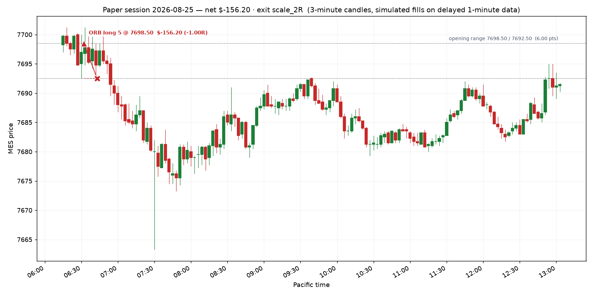

# Paper session — 2026-08-25

**Net P&L $-156.20** · 1 trade(s) · does not qualify (needs $300 net)

- Opening range: 7698.50 / 7692.50  (6.00 pts)
- Day ended: the day's one opening range break was taken and closed
- All times Pacific.
- One opening range break per day: the first one. If the Fib pullback appears afterwards it is the second trade, under the same day limits.
- Target was $325, loss stop was $450

## Trades

| in | out | setup | side | qty | entry | stop | exit | pts | R | net $ | exit reason |
|---|---|---|---|---|---|---|---|---|---|---|---|
| 06:32 | 06:43 | ORB | long | 5 | 7698.50 | 7692.50 | 7692.50 | -6.00 | -1.00 | -156.20 | stop |

## The day on a chart

Entry is the triangle, exit the cross, the dashed line is the stop that was working while the trade was on; the dotted levels are the opening range.

## Setups the rules refused

- Cooldown after a loss: 10 min remaining (revenge-trade guard).
- FIB short: Reward:risk is 1.36:1, below your 1.5:1 minimum. Skip it — Apex also prohibits disproportionate risk outright.
- FIB short: Reward:risk is 1.15:1, below your 1.5:1 minimum. Skip it — Apex also prohibits disproportionate risk outright.
- FIB long: Reward:risk is 0.76:1, below your 1.5:1 minimum. Skip it — Apex also prohibits disproportionate risk outright.

## Where this leaves the account

- Balance $99,709.13 · total P&L $-290.87
- Qualifying days: **0 of 5** ($300+ net each)
- Profit to the first payout request: $3,890.87 of $3,600.00
- EOD threshold sits at a $97,576.41 balance — $1,976.52 of room below you
- Payout: still needs 5 more qualifying day(s) of >= $300 net; $3,890.87 more profit (need +$3,600)

_Simulated fills on delayed data. No broker, no orders, no automation — the engine only shows what the written rules would have done._

## The same day under the other exit rules

| exit rule | trades | net $ | best trade R | what the rule did |
|---|---|---|---|---|
| `scale_2R (live, the record)` | 1 | -156.20 | -1.00 | stop |
| `scale_1.5R` | 1 | -156.20 | -1.00 | stop |
| `be_1R` | 1 | -156.20 | -1.00 | stop |
| `trail_after_1R` | 1 | -156.20 | -1.00 | stop |

Only the live rule is in the journal. The rest are replays of the same bars in throwaway journals seeded with the same account history, so the sizing matches; one day of them means nothing on its own, but they stack up over the week.
