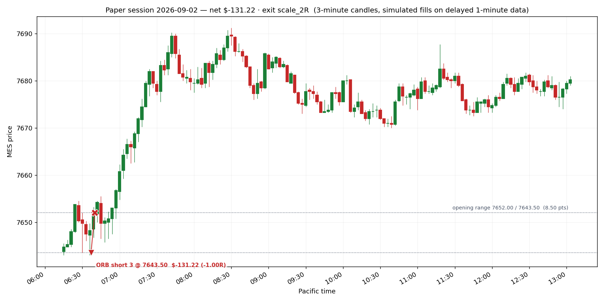

# Paper session — 2026-09-02

**Net P&L $-131.22** · 1 trade(s) · does not qualify (needs $300 net)

- Opening range: 7652.00 / 7643.50  (8.50 pts)
- Day ended: the day's one opening range break was taken and closed
- All times Pacific.
- One opening range break per day: the first one. If the Fib pullback appears afterwards it is the second trade, under the same day limits.
- Target was $325, loss stop was $450

## Trades

| in | out | setup | side | qty | entry | stop | exit | pts | R | net $ | exit reason |
|---|---|---|---|---|---|---|---|---|---|---|---|
| 06:37 | 06:40 | ORB | short | 3 | 7643.50 | 7652.00 | 7652.00 | -8.50 | -1.00 | -131.22 | stop |

## The day on a chart

Entry is the triangle, exit the cross, the dashed line is the stop that was working while the trade was on; the dotted levels are the opening range.

## Where this leaves the account

- Balance $99,685.56 · total P&L $-314.44
- Qualifying days: **0 of 5** ($300+ net each)
- Profit to the first payout request: $3,914.44 of $3,600.00
- EOD threshold sits at a $97,576.41 balance — $1,977.93 of room below you
- Payout: still needs 5 more qualifying day(s) of >= $300 net; $3,914.44 more profit (need +$3,600)

_Simulated fills on delayed data. No broker, no orders, no automation — the engine only shows what the written rules would have done._

## The same day under the other exit rules

| exit rule | trades | net $ | best trade R | what the rule did |
|---|---|---|---|---|
| `scale_2R (live, the record)` | 1 | -131.22 | -1.00 | stop |
| `scale_1.5R` | 1 | -131.22 | -1.00 | stop |
| `be_1R` | 1 | -131.22 | -1.00 | stop |
| `trail_after_1R` | 1 | -131.22 | -1.00 | stop |

Only the live rule is in the journal. The rest are replays of the same bars in throwaway journals seeded with the same account history, so the sizing matches; one day of them means nothing on its own, but they stack up over the week.
