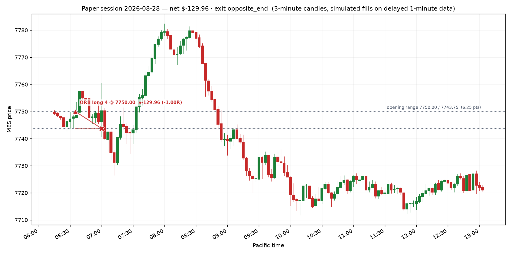

# Paper session — 2026-08-28

**Net P&L $-129.96** · 1 trade(s) · does not qualify (needs $300 net)

- Opening range: 7750.00 / 7743.75  (6.25 pts)
- Day ended: the day's one opening range break was taken and closed
- All times Pacific.
- One opening range break per day: the first one. If the Fib pullback appears afterwards it is the second trade, under the same day limits.
- Target was $325, loss stop was $450

## Trades

| in | out | setup | side | qty | entry | stop | exit | pts | R | net $ | exit reason |
|---|---|---|---|---|---|---|---|---|---|---|---|
| 06:35 | 07:00 | ORB | long | 4 | 7750.00 | 7743.75 | 7743.75 | -6.25 | -1.00 | -129.96 | stop |

## The day on a chart

Entry is the triangle, exit the cross, the dashed line is the stop that was working while the trade was on; the dotted levels are the opening range.

## Setups the rules refused

- FIB short: Stop is 16.25 pts — wider than your 12 pt max. A stop this wide means you do not actually know where you are wrong.
- FIB short: Reward:risk is 1.38:1, below your 1.5:1 minimum. Skip it — Apex also prohibits disproportionate risk outright.

## Where this leaves the account

- Balance $99,870.04 · total P&L $-129.96
- Qualifying days: **0 of 5** ($300+ net each)
- Profit to the first payout request: $3,729.96 of $3,600.00
- EOD threshold sits at a $97,000.00 balance — $2,740.08 of room below you
- Payout: still needs 5 more qualifying day(s) of >= $300 net; $3,729.96 more profit (need +$3,600)

_Simulated fills on delayed data. No broker, no orders, no automation — the engine only shows what the written rules would have done._

## The same day under the other exit rules

| exit rule | trades | net $ | best trade R | what the rule did |
|---|---|---|---|---|
| `opposite_end (live, the record)` | 1 | -129.96 | -1.00 | stop |
| `scale_2R` | 1 | -129.96 | -1.00 | stop |
| `scale_1.5R` | 1 | -129.96 | -1.00 | stop |
| `be_1R` | 1 | -4.96 | +0.00 | stop |
| `trail_after_1R` | 1 | +20.04 | +0.20 | stop |

Only the live rule is in the journal. The rest are replays of the same bars in throwaway journals seeded with the same account history, so the sizing matches; one day of them means nothing on its own, but they stack up over the week.
